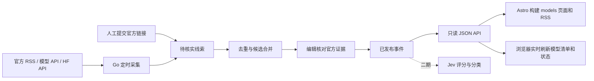

# Models 舆情中心：一期设计方案

> 状态：一期基础闭环代码已实现，待部署接入；首个自动线索来源 OpenAI News RSS 已实现，其他厂商逐家接入；Jev 评分仍按后续阶段推进。资料核对时间：2026-09-23。
> 本期的「舆情」范围是**各家大模型的发布动态**；社交讨论、情绪分析和 Jev 评分留到后续。

## 1. 产品边界

首页 `/models/` 回答三个问题：**谁发布了什么、何时发布、依据是什么**。收录 DeepSeek、OpenAI/ChatGPT、Anthropic/Claude、xAI/Grok、Kimi、MiniMax、GLM、腾讯混元、小米 MiMo。发布事件分为 `new_model`（新模型）、`model_update`（模型更新）、`availability`（开放渠道变化）、`retirement`（退役）。产品功能和价格变化只有在直接关联模型时才作为附属信息，不单独进入发布流。

每条公开记录都必须有可点击的官方证据，并明确区分：**官方宣布时间**、**系统发现时间**、**本站发布时间**。日期按来源原始时区保存，界面按访客时区展示；来源未给出精确时间时，只显示日期。厂商的自报 benchmark 只可标为「官方自报」，一期不生成本站分数或排名。

## 2. 不爬虫的来源策略

只接入官方提供的 RSS、模型列表 API、官方 Hugging Face 组织的 Hub API，以及人工录入的官方公告链接。**不解析公告网页列表、不抓社交平台页面、不把第三方转载当发布证据。** 模型列表/API 或权重仓库新增只形成「待核实线索」，因为可调用时间、仓库创建时间和正式发布日期可能不同；公开发布需核对官方公告或由编辑确认官方模型卡。

| 厂商 | 自动发现线索 | 官方发布依据 | 一期接入方式 |
|---|---|---|---|
| OpenAI / ChatGPT | [官方 News RSS](https://openai.com/news/rss.xml)（已验证有效）、[模型 API](https://developers.openai.com/api/reference/cli/resources/models) | [API changelog](https://developers.openai.com/api/docs/changelog)、[ChatGPT 模型发布说明](https://help.openai.com/en/articles/9624314)、RSS 中的模型公告 | RSS 采集已实现，启用后自动进入待核实队列；模型 API 尚待接入；ChatGPT 独有变更人工补录 |
| DeepSeek | [模型 API](https://api-docs.deepseek.com/api/list-models/)、[官方开源组织](https://huggingface.co/deepseek-ai/models) | [更新日志](https://api-docs.deepseek.com/updates/) | API/HF 差异进入待核实队列；公告链接人工确认 |
| Claude | [模型 API](https://platform.claude.com/docs/en/api/models/list) | [Claude Platform 发布说明](https://platform.claude.com/docs/en/release-notes/overview) | API 差异进入待核实队列；公告链接人工确认 |
| Grok | [模型 API](https://docs.x.ai/developers/rest-api-reference/inference/models) | [xAI 发布说明](https://docs.x.ai/developers/release-notes) | API 差异进入待核实队列；公告链接人工确认 |
| Kimi | [模型 API](https://platform.kimi.com/docs/api/list-models.md) | [官方模型清单](https://platform.kimi.com/docs/models.md)及官方公告 | API 差异进入待核实队列；公告链接人工确认 |
| MiniMax | [模型 API](https://platform.minimax.io/docs/api-reference/models/openai/list-models) | [模型发布记录](https://platform.minimax.io/docs/release-notes/models) | API 差异进入待核实队列；公告链接人工确认 |
| GLM | [Z.ai 官方 HF 组织](https://huggingface.co/zai-org/models) | [模型发布记录](https://docs.z.ai/release-notes/new-released) | HF 差异进入待核实队列；公告链接人工确认 |
| 腾讯混元 | [腾讯官方 HF 组织](https://huggingface.co/tencent/models) | [TokenHub 产品动态](https://cloud.tencent.com/document/product/1823/130675) | HF 差异进入待核实队列；只收腾讯自研 Hy/HY 模型，排除 TokenHub 聚合的第三方模型 |
| 小米 MiMo | [小米官方 HF 组织](https://huggingface.co/XiaomiMiMo/models) | [MiMo 官网](https://mimo.xiaomi.com/)和[开放平台新闻](https://platform.xiaomimimo.com/docs/en-US/news/previous-news/v2.5-tts-release) | HF 差异进入待核实队列；公告链接人工确认 |

除 OpenAI News 外，以上厂商**尚未核实到官方 RSS**；不能假设发布说明页有 Feed。Hugging Face 提供[官方 Hub API](https://huggingface.co/docs/hub/api)，可按官方组织查询模型；具体组织 ID 列入配置白名单，不能只靠模型名称匹配厂商。需要密钥的模型 API 作为可选连接器：没有密钥时标记为「未启用」，不能显示「已正常监测」。不同账号等级可能返回不同模型，API 的空结果也不能推断模型退役。

## 3. 工作流与发布规则

1. 定时任务按来源单独执行，记录上次游标、检查时间、响应状态和错误；RSS 使用 GUID/URL，模型 API 使用模型 ID 的集合差异，HF 使用组织 ID + 模型仓库 ID。支持 ETag/Last-Modified 的来源使用条件请求，并配置超时、退避和限频。
2. 原始观察记录只保存必要的元数据与官方 URL。`source_id + external_key` 幂等入库；不同来源疑似同一发布时给出合并建议，**不凭标题相似度自动合并或发布**。
3. 编辑把线索标为 `confirmed`、`dismissed` 或合并到已有事件。确认时填写厂商、模型标准 ID、事件类型、官方宣布时间、简述、可用渠道、证据链接。公开内容只取 `published` 状态。
4. 一批公开事件提交后只触发一次站点重建。采集失败保留上次成功数据，并在内部显示来源延迟；失败不能被当成「近期无发布」。

## 4. 领域模型与 Go 边界

Go 服务放在总目录下的独立仓库 `models-intel/`，作为**独立 Go module 和独立 SQLite 数据库**；不读写博客的 PocketBase 数据库。第一期采用一个进程和模块化单体，不拆微服务。

| 领域 | 核心对象 | 职责 |
|---|---|---|
| Sources | `Source`、`Observation` | 厂商与来源白名单、采集游标、原始线索、健康状态 |
| Releases | `ReleaseEvent`、`Evidence` | 发布事实、状态机、去重候选、官方证据、公开规则 |
| Assessments（二期） | `Assessment` | Jev 输出、评分版本、分类、理由与人工覆核；不改写发布事实 |

`ReleaseEvent` 至少包含 `id`、`vendor_id`、`model_family`、`model_id`、`title`、`event_type`、`summary`、`availability[]`、`announced_at`、`discovered_at`、`published_at`、`status`、`evidence[]`、`updated_at`。`Evidence` 保存 `source_url`、`source_kind`、`official`、`captured_at`；网页仅存 URL 和简短摘录，不复制整篇文章。`Observation` 与 `ReleaseEvent` 分表，避免 API 探测结果直接变成新闻。数据迁移保留 SQLite 版本脚本。

领域对象和发布规则放 `internal/domain`，用例放 `internal/application`，RSS/API/HF、SQLite、HTTP、Jev 实现放 `internal/adapters`。应用层只依赖端口接口：`SourceReader`、`ObservationRepository`、`ReleaseRepository`、`AssessmentPort`、`PublishNotifier`。未来替换数据源、迁仓或接入 Jev 时不改领域规则。

### 只读与管理接口（拟定）

- `GET /v1/releases?limit=&cursor=&vendor=&type=`：仅返回已发布事件，游标分页；响应含 `generated_at`。
- `GET /v1/releases/{id}`：单条事件和官方证据。
- `GET /v1/sources/status`：各厂商最近成功检查时间、接入方式和是否降级；对外不暴露密钥或原始响应。
- `GET /v1/models`：由每个厂商和模型 ID 的最近一条已发布官方事件生成当前清单、官方记录状态与来源；管理员发布后立即可读。
- `POST /v1/admin/observations`：人工提交官方链接；`POST /v1/admin/releases/{id}/publish`：审核发布；管理接口要求鉴权并记审计日志。
- `GET /healthz`：进程存活；`GET /readyz`：数据库与迁移就绪。

接口契约在实现前以 OpenAPI 固定；发布流向 Astro 的 JSON 维持向后兼容。服务密钥使用环境变量或部署密钥，不进入 Git。部署时只开放只读端点；管理端点限制登录和访问来源。

## 5. 网页方案

遵循站点现有[设计 Spec](SPEC.md)：浅色为留白的编辑排版，深色为克制的信号控制台；以列表和文字为主，不新造卡片仪表盘、持续动画或首屏扫描线。

- `/models/`：页头说明范围与最后更新时刻；下方是可筛选的时间线。每行展示宣布日期、厂商、模型、事件类型和一行摘要；点入详情。
- `/models/` 模型清单：按厂商与模型 ID 汇总最近一次已核实并发布的官方事件，显示已宣布、官方记录可用或退役状态以及原始来源。状态表示官方记录，不表示本站已执行 API 健康探测。
- `/models/{id}/`：发布事实、API/网页/开源权重等可用渠道、官方来源、发现与校验时间。信息未核实时显示「待核实」在后台队列，不在公开页暗示已发布。
- 筛选：厂商、事件类型、年份；URL 查询参数可分享、可返回。窄屏筛选项换行或折叠，键盘可操作，保留清晰焦点态。
- `/models/rss.xml`：只输出已发布事件，方便用户订阅。初期不做排行榜、折线图、社区情绪曲线或自动评分。

Astro 仍是静态站。构建时从 Go 服务的公开只读 API 取 `published` 数据生成可离线阅读的快照和 RSS；浏览器打开页面后读取 `/v1/models`、`/v1/releases` 与 `/v1/sources/status`，每 30 秒刷新模型清单、状态、时间线和来源健康状态。新事件使用无需重建的实时详情页；RSS 与预生成详情页仍在下一次构建时更新。Go 服务仅监听同机 `127.0.0.1:8080`，Nginx 将本站 `/models-api/` 转发到它；GitHub Actions 构建使用 `MODELS_SERVICE_URL=https://monostich.cloud/models-api`，浏览器使用同域 `PUBLIC_MODELS_SERVICE_URL=/models-api`，无需 CORS。部署流水线确认服务 API 已就绪；**先部署 Go 服务，再让站点构建依赖它**。前端落点为 `src/pages/models/`、`src/components/Nav.astro`、独立 models RSS；页面脚本需兼容现有 `astro:page-load`。导航增加第六项时检查 701px 附近的宽度。

## 6. Jev 二期接口

一期只定义 `AssessmentPort.Assess(release_snapshot) -> assessment_draft`，默认实现为空。二期 Jev 接入后，输入为已确认发布事实及官方证据，输出建议包含 `category`、`score`、`confidence`、`reason`、`rubric_version`、`jev_model_version`、`evaluated_at`。评分和分类必须能重跑、能追溯评分规则版本；人工覆核后再公开。Jev 故障不影响发布监测和网页构建。

## 7. 实施顺序与验收

1. **基础闭环**：Go 服务、SQLite 迁移、人工录入与审核、只读 API、Astro 时间线和独立 RSS。先用真实官方链接校验数据结构与排版。
2. **自动线索**：接 OpenAI RSS、官方 HF 组织；逐个接入有凭据的厂商模型 API。每个连接器有健康状态、幂等检查和失败告警。
3. **发布效率**：同事件候选合并、批量审核与单次重建；补充来源覆盖率和延迟提示。
4. **Jev 二期**：接评分端口、版本化规则、覆核展示。

一期验收：九家厂商都能通过官方链接进入审核和公开流程；有结构化源的厂商可自动产生线索；无凭据或无 Feed 的来源如实显示人工/降级状态；重复采集不重复发稿；所有公开事件可追溯官方证据；Go 服务停摆时旧页面继续可读。准确性优先于分钟级时效。

## 8. 原始设计稿交付范围

原始设计稿交付时只建立了本文档与 `models-intel/` 可迁移目录骨架。后续实现按第 7 节一期基础闭环落地：Go/SQLite 人工审核 API、OpenAPI 契约、Astro 时间线/详情页与独立 RSS。自动采集仍属于第二步，Jev 属于第四步。
